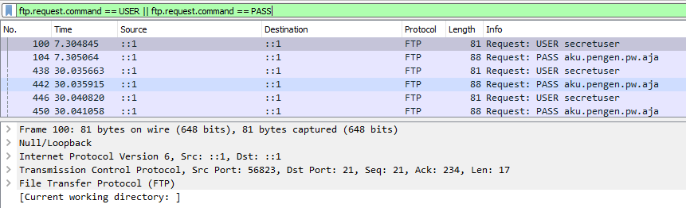
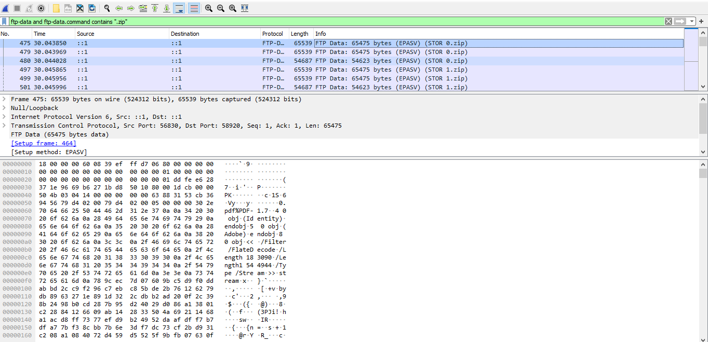
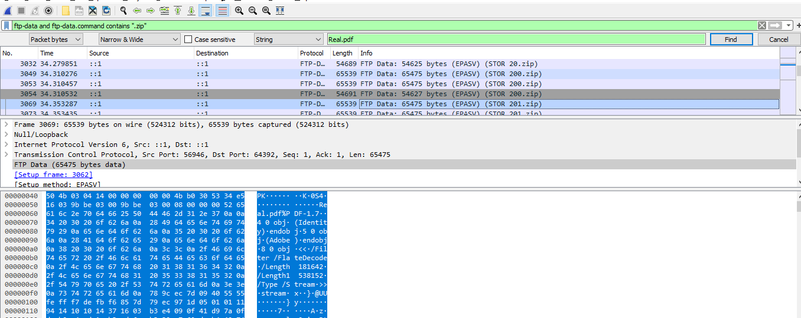
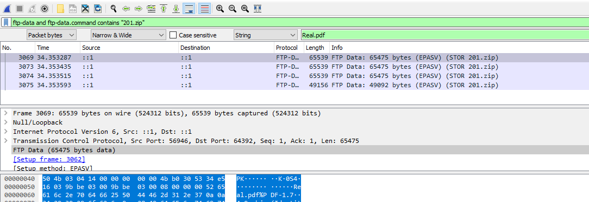
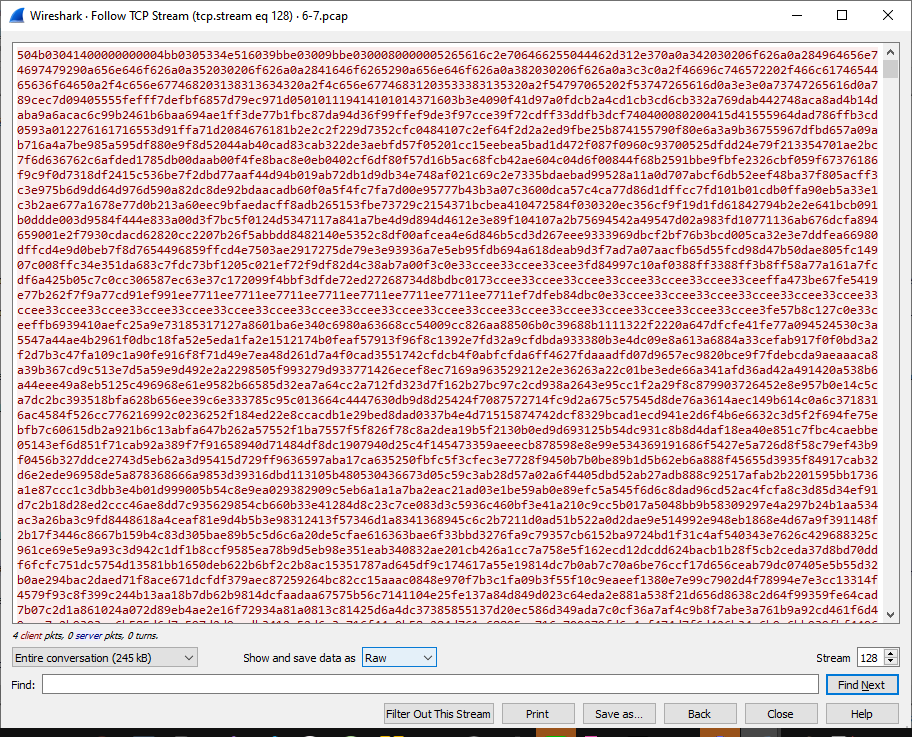
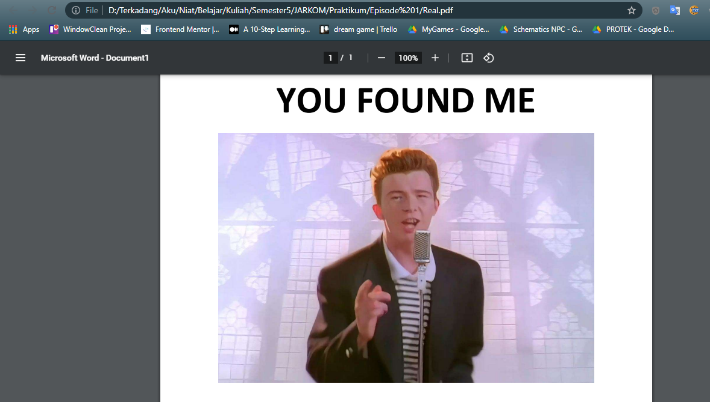

# Jarkom-Modul-1-B03-2021

Jaringan Komputer B
Kelompok B3
-	Dewangga Dharmawan (05111940000029)
-	Ahmad Syafiq Aqil Wafi (05111940000089)
-	Nouvelli Cornelia (05111940000011)

## 1.	Sebutkan webserver yang digunakan pada "ichimarumaru.tech"! (nginx/1.18.0 (Ubuntu))

Filter:
	```https.host eq “ichimarumaru.tech” ```


## 2.	Temukan paket dari web-web yang menggunakan basic authentication method!

Filter:
```http.authbasic```


 
## 3.	Ikuti perintah di basic.ichimarumaru.tech! Username dan password bisa didapatkan dari file .pcapng!

Filter:
```http.host eq "basic.ichimarumaru.tech" and http.authbasic```

```
Username : kuncimenujulautan
Password : tQKEJFbgNGC1NCZlWAOjhyCOm6o3xEbPkJhTciZN
```


Setelah masuk ke laman berikutnya 


## 4.	Temukan paket mysql yang mengandung perintah query select!

Filter:
```mysql.query == “select” ```


Maka akan ditampilkan sesuai filter
 

## 5.	Login ke portal.ichimarumaru.tech kemudian ikuti perintahnya! Username dan password bisa didapat dari query insert pada table users dari file .pcap!

Filter:
``` mysql ```


```
Username: akakanomi
Password: pemisah4lautan
```


## 6. Cari username dan password ketika melakukan login ke FTP Server!

Untuk melakukan filter FTP maka kita gunakan filter `ftp`.

Karena yang dicari merupakan info login, maka terjadi request login ke ftp jadi kita gunakan filter `ftp.request`.

Karena mencari user untuk login ftp maka kita cari command USER menggunakan filter `ftp.request.command == USER`

Karena mencari password untuk login ftp maka kita cari command PASS menggunakan filter `ftp.request.command == PASS`

Sehingga kita gabungkan filter tersebut menjadi berikut.

```
ftp.request.command == USER || ftp.request.command == PASS
```

Sehingga didapatkan hasil sebagai berikut.



Sehingga informasi user ftp dapat diambil kesimpulan sebagai berikut.

```
username: secretuser
password: aku.pengen.pw.aja
```

## 7. Ada 500 file zip yang disimpan ke FTP Server dengan nama 0.zip, 1.zip, 2.zip, ..., 499.zip. Simpan dan Buka file pdf tersebut. (Hint = nama pdf-nya "Real.pdf")

Untuk melakukan filter upload sebuah file ftp maka kita gunakan filter `ftp.data`.

Karena diketahui yang dicari adalah file `.zip` maka kita cari yang terdapat perintah ".zip" maka kita gunakan filter berikut.

```
ftp-data and ftp-data.command contains ".zip"
```

Sehingga didapatkan hasil sebagai berikut.



Karena terdapat banyak sekali file `.zip` dan tidak dimungkinkan untuk mencari satu - satu pada setiap packet nya. Maka kita manfaatkan fitur filter packet bytes dan mencari file dengan nama "Real.pdf".

Untuk melakukan filter packet kita buka menu nya dari Edit > Find Packet. Lalu pilih settings filter Packet Bytes dengan tipe String. Untuk mempermudah kita matikan pencarian secara Case Sensitive. Lalu filter "Real.pdf". Sehingga didapatkan hasil sebagai berikut.



Dapat terlihat bahwa yang memiliki string "Real.pdf" adalah file "200.zip" dan "201.zip". Sehingga kita perlu periksa kedua file tersebut. Namun untuk lebih sederhana, kami telah memeriksa kedua file dan file ada pada file "201.zip" sehingga kami hanya menjelaskan file "201.zip".

Karena kita tahu file ada pada "201.zip" maka lakukan filter file tersebut menggunakan filter berikut.

```
ftp-data and ftp-data.command contains "201.zip"
```



Pada hasil filter file "201.zip" yang paling pertama lakukan Follow TCP Stream.

Lalu kita extract / download packet tersebut dan menyimpannya pada suatu directory. Lakukan settings sebelum menyimpan file dengan lakukan save Entire Conversation, Show and Save data as Raw lalu Save As dan beri nama "Real.pdf".



Langkah terakhir buka file tersebut.



## 10. Selain itu terdapat "history.txt" yang kemungkinan berisi history bash server tersebut! Gunakan isi dari "history.txt" untuk menemukan password untuk membuka file rahasia yang ada di "secret.zip"!

Filter : ftp-data and ftp-data.command contains ".txt"


Password Zip : d1b1langbukanapaapajugagapercaya


## 11.Filter sehingga wireshark hanya mengambil paket yang berasal dari port 80!

Filter:
tcp.srcport == 80


## 12.	Filter sehingga wireshark hanya mengambil paket yang mengandung port 21!

Filter:
tcp.port == 21


## 13.	Filter sehingga wireshark hanya menampilkan paket yang menuju port 443!

Filter:
tcp.dstport == 443


## 14.	Filter sehingga wireshark hanya mengambil paket yang tujuannya ke kemenag.go.id!

Filter:
tcp contains "kemenag" and ip.src == 192.168.1.3


## 15.	Filter sehingga wireshark hanya mengambil paket yang berasal dari ip kalian!
membuka cmd untuk mengetahui ip dengan ‘ipconfig’
kemudian ip.src di wireshark 

Pertama, cari alamat IPv4 melalui CmD


Ditemukan alamat 192.168.1.3

Filter:
ip.src == 192.168.1.3


